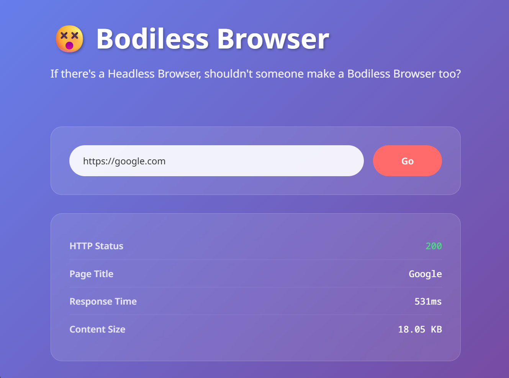

# 😵 Bodiless Browser

**If there's a Headless Browser, shouldn't someone make a Bodiless Browser too?**

## 🎯 What does this do?

A web browser that does what Headless Browser doesn't do.

When you enter a URL, it shows you:
- HTTP status (200, 404, 500, etc.)
- Page title
- Response time
- Content size
- That's it.

No rendering. No JavaScript execution. No complex features.

## 📸 Screenshot



## 🚀 Why did you make this?

I was bored.

## 📦 Installation

### Method 1: Download executable

Just download and run. No installation required.

### Method 2: Build from source

1. **Install dependencies**
   ```bash
   npm install
   ```

2. **Run development mode**
   ```bash
   npm run tauri dev
   ```

3. **Build**
   ```bash
   npm run tauri build
   ```

## 🤔 FAQ

**Q: Can I add features?**  
A: Of course, but keeping it simple is the charm.

## 🤝 Contributing

Feel free to contribute.

## 📄 License

MIT
